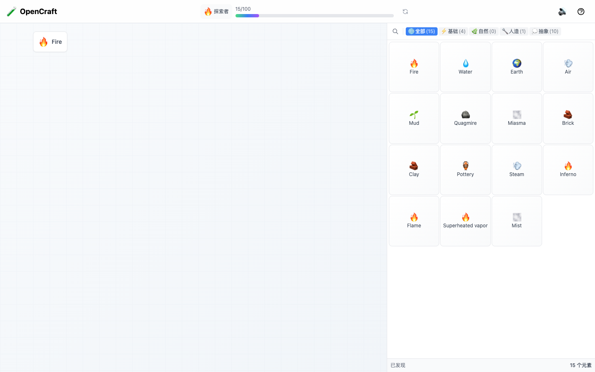
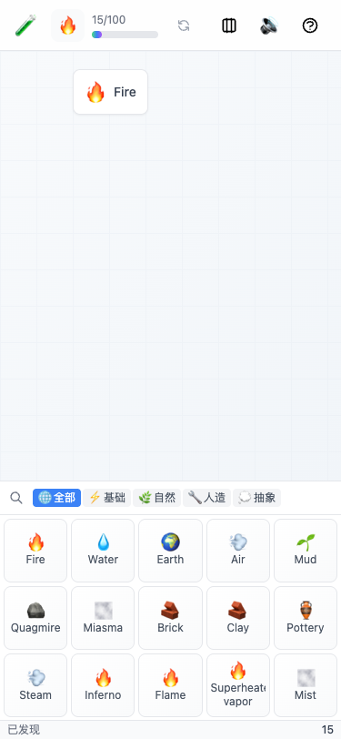
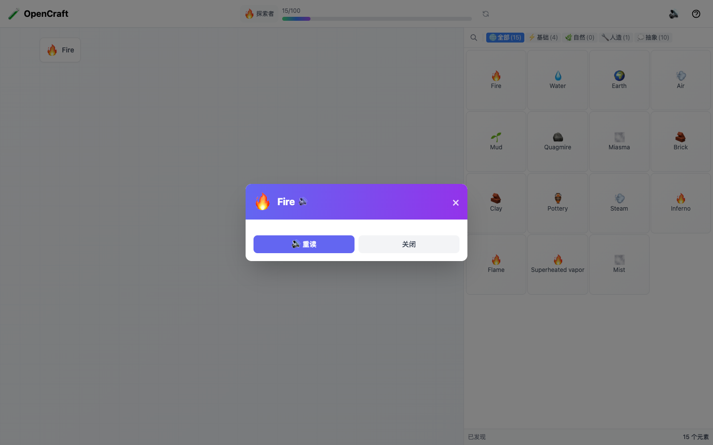
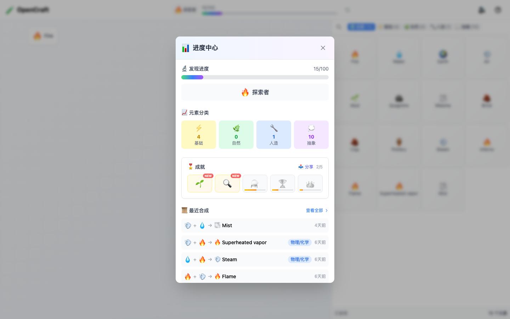
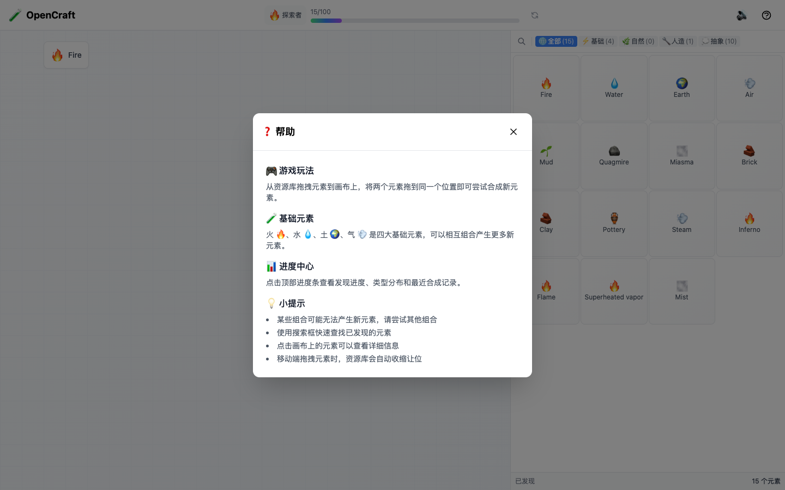

# OpenCraft

<div align="center">


**AI 驱动的无限元素合成游戏**

[](https://www.apache.org/licenses/LICENSE-2.0)
[](https://reactjs.org/)
[](https://fastapi.tiangolo.com/)
[](https://www.python.org/)

[演示视频](#演示视频) · [快速开始](#快速开始) · [功能特性](#功能特性) · [技术架构](#技术架构)

</div>

---

## 📖 项目简介

OpenCraft 是一款灵感来源于经典游戏《Little Alchemy》的元素合成游戏。玩家从四大基础元素（火🔥、水💧、土🌍、气💨）出发，通过自由组合探索无限可能的新元素。

与传统合成游戏不同，OpenCraft 引入 **大语言模型 (LLM)** 作为元素合成引擎，使得合成结果具有无限的创造性和不可预测性。每一次组合都是一次新的探索旅程。

> *OpenCraft 的元素合成本质上是一种微型语义推理：从物理规律（**火+水→蒸汽**）到文化重组（**蝙蝠+人→蝙蝠侠**），将抽象概念具象化。这一机制与大语言模型的文化转译能力高度契合——基础元素库如同文化核心概念（**阴阳**、**五行**、**节气**），LLM 则扮演文化编织者角色，将"**龙**"从西方恶兽转化为**东方祥瑞**，将"**茶**"从饮品升华为**生活哲学**。*
> *当"**节气+雨**"生成"**谷雨**"并附带农耕内涵，当"**墨+纸"**延伸出"**文人风骨**"的精神隐喻，这种超越字面翻译的深度语义生成，正是大模型文化国际化的潜力所在。

> 我们期愿 OpenCraft 不仅是一款游戏，更是一扇窗口，展现人工智能在启迪思维、促进理解、连接文化方面的无限可能。*

### 核心亮点

- 🤖 **AI 驱动合成** - 基于 LLM 的智能元素生成，支持多种 AI 提供商
- 🎨 **现代 UI/UX** - React 18 + TailwindCSS，响应式设计，支持移动端
- 🧪 **推理追溯** - 记录每个元素的合成路径和推理逻辑
- 🏆 **成就系统** - 成长阶段和成就解锁，增强游戏体验
- 🔊 **音效反馈** - 程序化音效和语音播报，沉浸式体验
- 📦 **开箱即用** - 完整的容器化部署方案

---
## 演示视频
<div align="center">

[](assets/craft-it-demo-01.mp4)

*点击图片观看演示视频*

</div>

<video src="assets/craft-it-demo-01.mp4" controls width="100%" style="max-width: 800px; border-radius: 8px; box-shadow: 0 4px 12px rgba(0,0,0,0.1);">
  您的浏览器不支持视频播放。
</video>


## 📸 应用截图

### 桌面端界面


*主界面展示：左侧为元素资源库，中间为合成画布，顶部显示进度和成就*

### 移动端界面



*移动端自适应布局：资源库可折叠，画布区域最大化*

### 核心功能展示

| 元素详情弹窗 | 进度中心面板 |
|:---:|:---:|
|  |  |

| 帮助面板 |
|:---:|
|  |

---

## ✨ 功能特性

### 🎮 游戏玩法

| 功能 | 描述 |
|------|------|
| **拖拽合成** | 将两个元素拖拽到同一位置触发合成 |
| **元素发现** | 发现新元素自动加入资源库 |
| **进度追踪** | 实时显示发现进度和成长阶段 |
| **元素详情** | 查看元素的定义、合成类型和来源 |

### 🧠 AI 合成引擎

支持 5 种合成类型：

| 类型 | 示例 |
|------|------|
| 物理/化学 | Fire + Water → Steam 💨 |
| 文化/流行 | Bat + Man → Batman 🦇 |
| 概念/隐喻 | Time + Fly → Nostalgia 💭 |
| 语言/双关 | Rain + Bow → Rainbow 🌈 |
| 功能/工具 | Blade + Handle → Knife 🔧 |

### 📊 数据持久化

- **本地存储**: 使用 localStorage 持久化游戏进度
- **服务端缓存**: SQLite 缓存合成结果，相同组合始终返回相同结果
- **离线支持**: 已发现的元素可离线浏览

---

## 🚀 快速开始

### 前置要求

- **开发环境**: Node.js >= 18.0, Python >= 3.11
- **生产环境**: Docker 和 Docker Compose
- **LLM API Key**: 支持 OpenAI、DeepSeek、智谱AI 等

### 开发环境

适合本地开发和调试：

```bash
# 1. 克隆仓库
git clone https://github.com/aicorp-cn/opencraft.git
cd opencraft

# 2. 配置后端环境变量
cp server-python/.env.example server-python/.env
# 编辑 server-python/.env 文件，填入你的 LLM API Key

# 3. 启动开发环境
./dev.sh start

# 4. 访问应用
# 前端: http://localhost:5173
# 后端: http://localhost:3000
```

### 生产环境 (Docker Compose)

适合生产部署，一键启动完整服务：

```bash
# 1. 克隆仓库
git clone https://github.com/aicorp-cn/opencraft.git
cd opencraft

# 2. 配置环境变量
cp .env.example .env
# 编辑 .env 文件，填入你的 LLM API Key

# 3. 构建并启动服务
docker-compose up -d

# 4. 访问应用
# http://localhost
```

**Docker Compose 配置说明**：

| 服务 | 端口 | 资源限制 | 说明 |
|------|------|----------|------|
| frontend | 80 | 128MB / 0.5 CPU | Nginx 静态服务 |
| backend | 3000 (内部) | 256MB / 1 CPU | FastAPI API 服务 |

**支持的 LLM 提供商**：

| 提供商 | LLM_BASE_URL | 推荐模型 |
|--------|--------------|----------|
| OpenAI | https://api.openai.com/v1 | gpt-4o-mini |
| DeepSeek | https://api.deepseek.com/v1 | deepseek-chat |
| 智谱AI | https://open.bigmodel.cn/api/paas/v4 | glm-4-flash |
| Moonshot | https://api.moonshot.cn/v1 | moonshot-v1-8k |
| Ollama (本地) | http://host.docker.internal:11434/v1 | llama3 |

详细部署指南请参考 [部署文档](docs/DEPLOYMENT.md)。

---

## 🏗️ 技术架构

```
opencraft/
├── frontend-react/          # React 前端
│   ├── src/
│   │   ├── components/      # UI 组件
│   │   │   └── dnd-v2/      # 拖拽系统（基于 dnd-kit）
│   │   ├── stores/          # Zustand 状态管理
│   │   ├── services/        # 音效、分享服务
│   │   ├── constants/       # 合成类型定义
│   │   └── pages/           # 页面组件
│   └── vite.config.ts
│
├── server-python/           # FastAPI 后端
│   ├── app/
│   │   ├── routers/         # API 路由 (/api/craft)
│   │   ├── services/        # LLM 服务、缓存服务
│   │   ├── models/          # SQLAlchemy 模型
│   │   ├── schemas/         # Pydantic 模型
│   │   └── prompts/         # LLM 提示词模板
│   └── Dockerfile
│
├── docs/                    # 文档目录
├── dev.sh                   # 开发环境管理脚本
└── docker-compose.yml       # Docker 编排配置
```

### 技术栈

| 层级 | 技术 |
|------|------|
| **前端** | React 18, TypeScript, Vite, Zustand, dnd-kit, TailwindCSS |
| **后端** | Python 3.11, FastAPI, SQLAlchemy 2.0 (async), SQLite |
| **AI 引擎** | OpenAI SDK (兼容 DeepSeek、智谱AI、Moonshot 等) |
| **容器化** | Docker, docker-compose |

---

## 📚 文档

- [前端文档](frontend-react/README.md) - 前端架构、组件说明、开发指南
- [后端文档](server-python/README.md) - API 文档、LLM 配置、数据库模型
- [部署文档](docs/DEPLOYMENT.md) - 详细部署指南
- [贡献指南](CONTRIBUTING.md) - 如何参与项目开发

---

## 🗺️ Roadmap

### v1.1.0 (进行中)

#### 前端优化
- [ ] 修复虚拟滚动 estimateSize 与实际行高失配问题
- [ ] 优化移动端资源卡标题截断逻辑
- [ ] 添加桌面端资源卡 tooltip 显示完整名称
- [ ] 实现资源卡分类颜色标识
- [ ] 支持自定义主题和暗色模式

#### 功能增强
- [ ] 元素收藏/标记功能
- [ ] 搜索历史记录
- [ ] 合成配方提示系统
- [ ] 元素详情弹窗（显示合成路径）

#### 性能优化
- [ ] 图片资源懒加载
- [ ] 虚拟滚动动态测量优化
- [ ] 减少 re-render 次数

### v1.2.0 (规划中)

#### 多端适配
- [ ] PWA 支持（离线访问）
- [ ] 移动端手势优化
- [ ] 平板设备适配

#### 社交功能
- [ ] 分享合成成果
- [ ] 排行榜系统
- [ ] 成就系统

#### AI 增强
- [ ] 智能合成建议
- [ ] 元素关联图谱可视化
- [ ] 多语言支持（基于 LLM 翻译）

### v2.0.0 (长期规划)

#### 核心升级
- [ ] 多人协作模式
- [ ] 自定义元素创建
- [ ] 元素组合规则编辑器
- [ ] 模块化扩展系统

#### 架构演进
- [ ] 微服务化改造
- [ ] WebSocket 实时同步
- [ ] 分布式缓存（Redis）
- [ ] PostgreSQL 数据库支持
---

## 🤝 贡献

我们欢迎所有形式的贡献！

### 贡献方式

- 🐛 报告 Bug 或提出新功能建议
- 📝 改进文档
- 🔧 提交代码修复或新功能
- 🌟 给项目点 Star

### 开发流程

```bash
# 1. Fork 并克隆仓库
git clone https://github.com/YOUR_USERNAME/opencraft.git

# 2. 创建功能分支
git checkout -b feature/your-feature

# 3. 提交更改
git commit -m "feat: add your feature"

# 4. 推送分支
git push origin feature/your-feature

# 5. 创建 Pull Request
```

详见 [贡献指南](CONTRIBUTING.md)。

---

## 📄 许可证

本项目基于 [Apache License 2.0](LICENSE) 开源。

---

## 👥 开发团队

<div align="center">

**AICorp**

[](https://github.com/aicorp-cn)

</div>

---

## 🙏 致谢

- 灵感来源：[Little Alchemy](https://littlealchemy.com/)
- 拖拽库：[dnd-kit](https://dndkit.com/)
- UI 框架：[TailwindCSS](https://tailwindcss.com/)
- 后端框架：[FastAPI](https://fastapi.tiangolo.com/)

---

<div align="center">

**如果这个项目对你有帮助，请给一个 ⭐ Star 支持我们！**

Made with ❤️ by AICorp

</div>